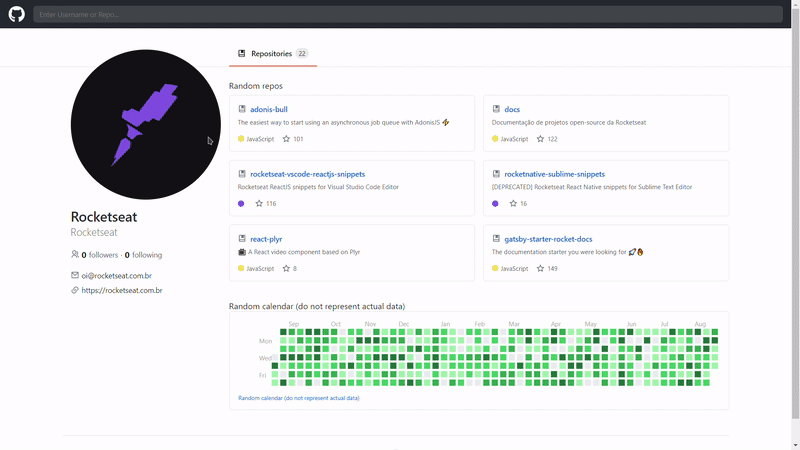

<h1 align="center">
 
  GITHUB CLONE
</h1>

Github profile page clone with access to repositories.

 <a href="/#-features">Features</a> •
 <a href="/#-tech">Technologies</a> • 
 <a href="/#-licenca">License</a> • 

  

  
  
  
  

<h4 align="center"> 
	🚧  React Select 🚀 Not continued ...  🚧
</h4> 

# Features 

- [x] Github public API
- [x] Dark mode
- [x] Search Github Users
- [x] Go to Github repositories

### 🛠 Technologies 

The following tools was used in this project:
- [React](https://www.reactjs.org/)
- [TypeScript](https://www.typescriptlang.org/)

## Getting started 

In the project directory, you can run:

### `yarn start`

Runs the app in the development mode. 
Open [http://localhost:3000](http://localhost:3000) to view it in the browser.

The page will reload if you make edits. 
You will also see any lint errors in the console.

## License 

	This project is licensed under the MIT License - see the  
  
	for details.

